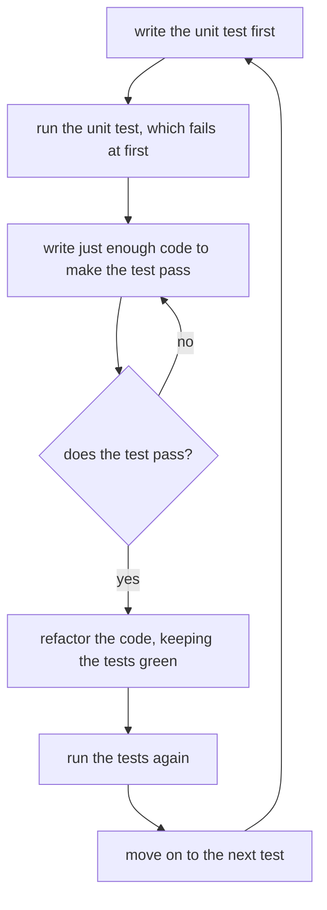

# Loop

```mermaid
flowchart TD
    a[write the unit test first] --> b[run the unit test, which fails at first]
    b --> c[write just enough code to make the test pass]
    c --> d{does the test pass?}
    d -- no --> c
    d -- yes --> e[refactor the code, keeping the tests green]
    e --> f[run the tests again]
    f --> g[move on to the next test]
    g --> a
```
